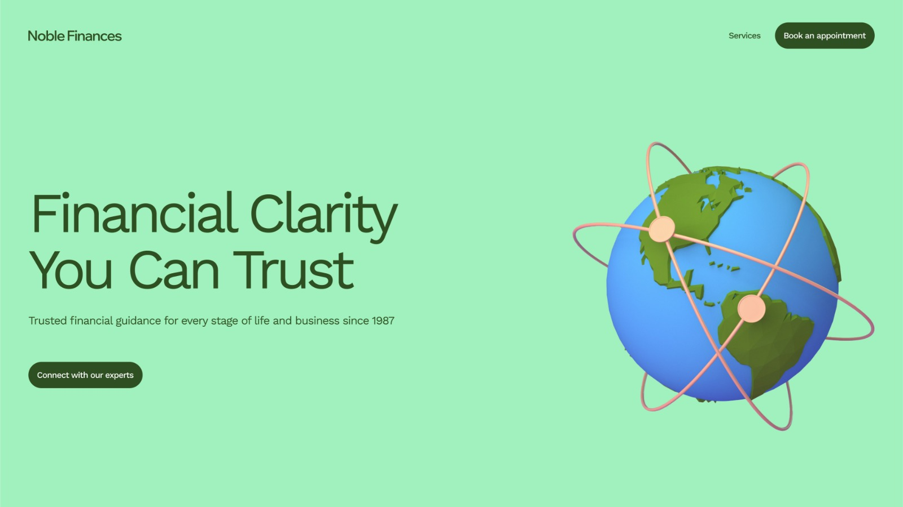

# 💼 Noble Finances Landing Page

Uma landing page moderna e responsiva para uma empresa fictícia de consultoria financeira chamada **Noble Finances**.  
Desenvolvida para praticar conceitos de desenvolvimento front-end, como responsividade, estrutura semântica, design de interface e interações com JavaScript.

---

## 🌐 Preview do Projeto

Você pode visualizar o projeto aqui:

🔗 *Futuro deploy*

---

## 📸 Preview



---

## 🛠️ Tecnologias Utilizadas

- HTML5
- CSS3
- JavaScript
- Design Responsivo
- Flexbox & CSS Grid
- Mobile First

---

## 🎯 Objetivos do Projeto

O objetivo deste projeto é:

- Praticar desenvolvimento front-end responsivo
- Melhorar habilidades de estruturação de layouts
- Construir seções modernas baseadas em um design do Figma
- Praticar manipulação do DOM com JavaScript
- Melhorar o uso de HTML semântico
- Criar estruturas de código limpas e reutilizáveis

---

## 📱 Responsividade

O layout se adapta para diferentes tamanhos de tela:

- 📱 Dispositivos móveis
- 💻 Tablets
- 🖥️ Computadores/Desktop

O projeto foi desenvolvido pensando em uma experiência fluida em diferentes dispositivos.

---

## 🚀 Como Executar o Projeto

Clone este repositório:

```bash
git clone https://github.com/Gabriel707Alves/Noble-Finances.git